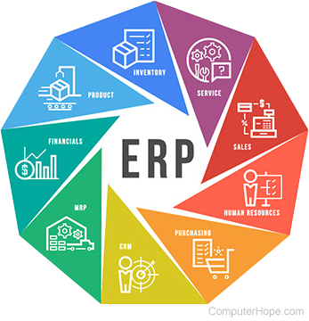

# Tarea: Práctica 2

>***Realiza un pequeño documento donde expliques con tus palabras la diferencia entre un ERP, un CRM, un CMS y una aplicación de E-Learning.***

* ### ERP:

Es un sistema que ayuda a automatizar y administrar los procesos empresariales de distintas áreas: finanzas, fabricación, venta al por menor, cadena de suministro, recursos humanos y operaciones. Los sistemas ERP desglosan los silos de datos e integran la información obtenida en los diversos departamentos, de esta forma, ayudan a los directivos a extraer conocimientos, optimizar operaciones y mejorar la toma de decisiones.

 
 
 

* ### CRM:

Los sistemas CRM permiten a las empresas almacenar información sobre los clientes, realizar un seguimiento de las interacciones y automatizar diversos procesos, lo que da lugar a un compromiso con el cliente más personalizado y eficaz. 

